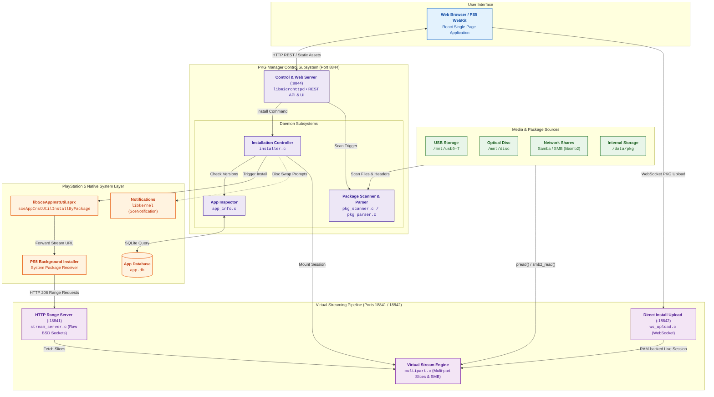

# PKG Manager - Architecture & Implementation Details

This document provides an in-depth architectural guide to the **PKG Manager** daemon, its internal subsystems, virtual HTTP streaming engine, Direct Install upload path, PlayStation 5 system installer integration, and storage paradigms.

---

## 1. Architectural Overview

PKG Manager is designed as a persistent native daemon (`pkgmgr.elf`) running in userland on PlayStation 5 (Prospero OS). It couples an embedded web-based control application with an HTTP range-streaming engine and direct integration with Sony's proprietary package installer subsystem (`libSceAppInstUtil.sprx`).



---

## 2. Network Services Architecture

The daemon exposes three network services on separate TCP ports to isolate interactive UI/API traffic from package streaming and Direct Install uploads:

| Port | Implementation | Primary Role | Features |
|:---|:---|:---|:---|
| **8844** | `libmicrohttpd` (MHD) | UI & REST API | Serves bundled React SPA, handles JSON REST endpoints, and serves cached package icons. |
| **18841** | Raw BSD Sockets (`stream_server.c`) | Virtual Stream Pipeline | Serves HTTP/1.1 206 Partial Content byte ranges directly to the PS5 background installer with custom socket timeouts and `MSG_NOSIGNAL` sends. |
| **18842** | Raw WebSocket listener (`ws_upload.c`) | Direct Install Upload | Receives PKG chunks from a LAN browser and feeds the RAM-backed live stream session used by the installer. |

### REST API Endpoints (Port 8844)

The primary web server handles all interactive user requests:
- **UI & Static Assets**: `/`, `/index.html`, `/favicon.svg`, `/icon.png`, `/cache.appcache`.
- **System & Version**: `/api/version`, `/api/storage`, `/api/settings` (GET & POST), `/api/log`, `/api/debug`.
- **Package Discovery**: `/api/drives`, `/api/packages`, `/api/packages/quick-scan`, `/api/packages/refresh`, `/api/scan/status`.
- **Package Icons**: `/api/icon` (extracts or serves cached `icon0.png`), `/api/icon-error`.
- **Installation Control**: `/api/install` (starts installation), `/api/cancel` (aborts current installation), `/api/poll` / `/api/status` (live progress), `/api/shortcut/install`.
- **Direct Install Control**: `/api/upload/init`, `/api/upload/status`, `/api/upload/icon`, `/api/upload/finish`, and `/api/upload/cancel`.
- **SMB & Metadata Cache**: `/api/smb/test`, `/api/cache/stats`, `/api/cache/clear`.
- **Leftovers Cleanup**: `/api/leftovers` (scans unlinked patches/DLCs), `/api/leftovers/delete` (purges selected orphans).

### Range Streaming Server (Port 18841)

The dedicated stream server (`stream_server.c`) handles package delivery to the PS5 background installer:
- Listens on raw BSD sockets at port 18841.
- Serves HTTP/1.1 `206 Partial Content` (and `HEAD`) responses directly via the virtual stream engine (`virtual_stream_read()`).
- Uses socket timeouts (`SO_RCVTIMEO`/`SO_SNDTIMEO`) and `MSG_NOSIGNAL` to handle client disconnects cleanly without process interruption.
- Session name pinning: each installation pins an exact session filename (e.g. `package-<unixtime>-<seq>.pkg`). Any stray or unexpected requests immediately return `404 Not Found`.
- Operates completely independently from `libmicrohttpd` on port 8844, preventing high-bandwidth installer range requests from degrading UI responsiveness.

---

## 3. Storage Model & Virtual Range Streaming

Instead of copying package files to the console's internal storage before installing, PKG Manager exposes packages via a virtual HTTP range-streaming endpoint on port 18841:

```text
http://127.0.0.1:18841/stream/install/package-<unixtime>-<seq>.pkg
```

### Key Advantages

1. **No 2x Storage Requirement**:
   Packages do not need to be staged on internal storage (`/data`) before installation. The console installer streams and extracts data directly to its target location, requiring only the space needed for the installed application itself (1x space) rather than keeping both the raw package and the installed files on disk (2x space).

2. **Direct Installation from Network Shares (SMB)**:
   The native PS5 package installer cannot access Samba/SMB network shares directly. The virtual stream engine bridges network reads into standard HTTP range responses, enabling direct network installation without mounting shares in the OS or copying packages locally first.

3. **Direct Install from a LAN Device**:
   A browser on a PC or other LAN device uploads a local PKG over WebSocket port 18842. The daemon keeps the upload in a bounded RAM-backed live session and exposes it through the same range-streaming path used by regular installs.

4. **Multi-Part & Optical Disc Swapping**:
   For packages split across multiple files or optical discs (BD-R, DVD), the virtual stream translates byte offsets across parts on the fly using `pread()`, allowing multi-part installations without pre-reassembling the files.

5. **Accurate Transfer Progress**:
   Streaming byte ranges through our own socket server allows the daemon to track delivery progress and stream metrics independently of system installer status polls.

---

## 4. Multi-Part Format (`PS5MPKG1`) & Virtual Stream Engine

The multi-part splitting format allows splitting large packages across standard optical media (BD-R, DVD) or FAT32/exFAT drives.

### Header Specification (4096 bytes)

All multi-part slices share a 4KB binary header defined in `include/multipart.h`:

```c
#pragma pack(push, 1)
typedef struct {
    char magic[8];               /* "PS5MPKG1" */
    uint32_t header_version;     /* 1 */
    uint32_t part_index;         /* 1-indexed (1, 2, ...) */
    uint32_t total_parts;        /* Total part count */
    uint32_t compression_type;   /* 0 = raw uncompressed sequential slice */
    uint32_t chunk_size;         /* Nominal slice block size (e.g. 2MB) */
    uint32_t num_chunks_in_part; /* 0 for uncompressed */
    uint64_t part_data_size;     /* Raw byte length of package slice in this file */
    uint64_t total_pkg_size;     /* Total size of the original uncompressed PKG */
    uint64_t total_archive_size; /* Combined byte size of all part files */
    char pkg_filename[256];      /* Original package filename */
    char title_id[32];           /* Extracted Title ID (e.g. "CUSA00000") */
    char title_name[256];        /* Application Name */
    char content_id[64];         /* Content ID */
    uint8_t package_uuid[16];    /* Unique 128-bit UUID shared by all parts */
    uint32_t icon_offset;        /* Offset of embedded icon0.png (4096 in Part 1) */
    uint32_t icon_size;          /* Length of embedded icon0.png */
    char app_version[32];        /* App version (e.g. "v01.00") */
    char pkg_type[16];           /* "base", "update", or "dlc" */
    uint64_t part_offset;        /* Offset in original package where slice starts */
    uint32_t data_offset;        /* File offset where raw package data begins */
    uint8_t reserved[3348];      /* Padding to 4096 bytes */
} multipart_header_t;
#pragma pack(pop)
```

### Storage Strategy
Multi-part slices are stored as **raw uncompressed sequential slices** (`compression_type = 0`) to allow direct random-access byte range streaming without decompression overhead.

### Optical Disc Swapping Pipeline

When a package spans across multiple optical discs:
1. The virtual stream engine reads slices from Disc 1 (`/mnt/disc`).
2. When the requested offset crosses into Part 2 (which is not mounted), `virtual_stream_read()` triggers the `g_stream_wait_disc_fn` callback.
3. The installer state enters `waiting_disc`, logs the event, and issues a PS5 system notification:
   `"Please insert Disc 2 of N for <title>"`
4. A background poll checks for optical disc remounting.
5. As soon as Disc 2 is inserted and detected (verified via UUID and Part index match), the stream automatically opens the new part's file descriptor and resumes streaming seamlessly.

---

## 5. PlayStation 5 System Installer Integration

The application interfaces directly with the PS5 OS package manager via `/system/common/lib/libSceAppInstUtil.sprx`.

### Function Signatures & Data Layout

```c
typedef struct {
    char languages[30][8];
    char playgo_scenario_ids[64][3];
    char content_ids[64][48];
    unsigned char unknown[6480];
} playgo_info_t;

typedef struct pkg_info {
    char content_id[48];
    int type;
    int platform;
} pkg_info_t;

typedef struct pkg_metadata {
    const char *uri;
    const char *ex_uri;
    const char *playgo_scenario_id;
    const char *content_id;
    const char *content_name;
    const char *icon_url;
} pkg_metadata_t;

int sceAppInstUtilInitialize(void);
int sceAppInstUtilTerminate(void);
int sceAppInstUtilInstallByPackage(const pkg_metadata_t *meta, pkg_info_t *info, playgo_info_t *playgo);
int sceAppInstUtilGetInstallStatus(const char* content_id, SceAppInstallStatusInstalled* status);
```

### Package Metadata & Installation Pipeline

When invoking `sceAppInstUtilInstallByPackage`, `pkg_metadata_t` is populated as follows:
- **`uri`**: Unique per-install streaming URL (`http://127.0.0.1:18841/stream/install/package-<unixtime>-<seq>.pkg`). Timestamping prevents URI collisions across successive installations.
- **`content_name`**: Formatted as `"<Title ID> (<Kind>)"` (e.g. `"CUSA00000 (Base)"` or `"CUSA00000 (Update)"`).
- **`content_id`**: Passed as an empty string `""`; the system installer reads the initial package header from the stream to populate `pkg_info.content_id`.
- **`ex_uri`**, **`playgo_scenario_id`**, **`icon_url`**: Passed as empty strings `""`.

### Host-Side PS5 Stream Simulator

To develop install methods (websocket client, direct stream creation) without a
console, the PS5's request pattern against the stream server is reproduced on
the host. The pattern, reverse-engineered from the captures in
`.for_reference/stream_debug/`, has three phases:

1. **Header acquisition** — a burst of short-lived connections, each re-reading
   the first 64 KiB (`Range: bytes=0-65535`) so the installer can parse /
   re-validate the package header.
2. **Sidecar CRC probe** — a single Range-less GET of
   `<content_id>.crc` that must return `404` when there is no companion file.
3. **Bulk transfer** — two parallel long-lived connections serving contiguous
   16 MiB byte-ranges across `[65536, end)` in an A/B ping-pong.

Every request carries the query the console appends
(`?product=0287&serverIpAddr=127.0.0.1&r=00000000`) against `:18841`.

The pure client half is `tests/ps5_sim.c` (raw HTTP/1.1, no dependency on the
server). `tests/test_stream_sim.c` pairs it against the real
`src/stream_server.c` and asserts the model holds; it is part of `make test`.
The standalone CLI (`tools/ps5_installer_sim.c`, launched via
`tools/run_stream_sim.sh`) can either start its own local server or point the
same replay at any live server — exactly the shape a future websocket / remote
install method needs. A correct HTTP/1.1 keep-alive reader is essential here:
absorbing body bytes into the header buffer desyncs a persistent connection and
makes the exact body read block on bytes the server already sent.

## 6. Direct-Install Upload Path

```
LAN browser (DirectInstallView) --ws://:18842--> ws_upload.c --RAM ring-->
virtual_stream ("live:<id>") --:18841--> installer.c (existing worker) --> system installer
```

`src/ws_upload.c` is transport only; `src/ws_stream.c` owns the bytes
(1 MB pinned header + 64 MB ring, `ws_live_*` symbols, no load-time side
effects, abort/timeout on every wait). The only touch points in existing
code are additive: a `live:` scheme branch in `virtual_stream_open`/`read`
(`multipart.c`), one `pkg_parser_parse_mem()` function reusing the in-file
sub-parsers, one `installer_start_live()` entry plus abort/destroy hooks
(`installer.c`), and a guarded `/api/upload/` REST branch plus `live:` URI
routing in `/api/install` (`http_server.c`). `src/stream_server.c` has
zero diff, so the pull contract verified by `test_stream_sim` still holds
byte-for-byte. Host proof: `test_ws_stream`, `test_parse_mem`,
`test_ws_upload`, `test_direct_install_e2e`, and
`tools/run_direct_install_sim.sh --demo` (fragmented socket push racing
the standard `ps5_sim` pull replay, byte-exact).

---

## 7. Package Parser & Metadata Engine (`pkg_parser.c`)

The package parser inspects packages directly on storage media using random-access `pread()`:

- **Format Detection**:
  - `\x7fCNT` (PS4 standard package header): parsed directly at file offset 0.
  - `\x7fFIH` (PS5 native package header): outer container format. Locates the internal CNT header at offset `0x58` or by scanning FIH table entries.
  - `PS5MPKG1` (Multi-part package header): parsed at offset 0.
- **Title ID & Content ID**: Read directly from the CNT header (offset `0x40`) or multi-part header.
- **SFO & JSON Parser**: Reads `param.sfo` (for PS4 titles) or `param.json` (for PS5 native titles) from the CNT entry directory table to extract localized Title Name, Application Version, and Category.
- **Package Category Classification**:
  - **Update**: `category` starting with `gp`, presence of playgo chunk patch (`app/playgo-chunk.dat` / entry `0x1008`), delta patch entries (`0x0407`, `0x0408`), or delta content type magic (`0x1E`, `0x41000000`).
  - **DLC / Extra Content**: `category` starting with `ac`, `al`, equal to `addcont`, or a CNT type whose low byte is `1` when `param.json` does not contain the standard base-application metadata fields. This avoids treating normal base packages that share the CNT value as DLC.
  - **Base App**: `category` starting with `gd`, `bd`, `gc`, `wt`, or default fallback when no update/DLC indicators are present.
- **Icon Extraction**: Locates uncompressed `icon0.png` data (entry type `0x1200` or named `icon0.png`) and serves it via `/api/icon?path=...`.

---

## 8. Storage & Drive Scanning (`pkg_scanner.c`)

The scanner monitors all mount points and builds the unified catalog:

1. **Drive Discovery**:
   - Checks USB mount points `/mnt/usb0` through `/mnt/usb7`.
   - Checks optical disc mount point `/mnt/disc`.
   - Checks internal storage `/data/pkg`.
   - Scans configured SMB network shares via `smb_client.c`.
2. **Scan Scope**:
   - Regular files directly in the drive root (`/mnt/usbX/*.pkg`).
   - Recursive scan into the designated `/pkg/` subfolder (`/mnt/usbX/pkg/...`).
   - Files located elsewhere on external drives are excluded to avoid scanning entire personal drives.
3. **Multi-Part Deduplication**:
   - Scans and validates multi-part slices.
   - Displays only Part 1 in the UI package list with a "Disc 1 of N" badge. Secondary parts (`.part2..N`) are indexed internally for disc swapping but hidden from the main list.
4. **Install Capacity**:
   - Reports available capacity for internal, M.2, and extended USB storage (`/mnt/ext0`).
   - Applies the supported storage targets when checking whether a package can be installed; PS4 packages can use internal, M.2, or extended USB storage, while PS5 packages use internal or M.2 storage.

---

## 9. Installed Application Database (`app_info.c`)

To prevent duplicate installations and guide the user:
- Queries the PS5 system SQLite database at `/system_data/priv/mms/app.db` (table `tbl_appinfo`).
- Checks base application files in `/user/app/<TitleID>/` (`sce_sys/param.sfo`, `sce_sys/param.json`, `eboot.bin`), `/system_ex/app/<TitleID>/`, and external storage (`/mnt/ext0/user/app/`).
  *(Note: Does not treat `/user/appmeta/` as proof of base installation, as appmeta directory trees persist after game uninstallation to preserve UI icons and trophy metadata caches).*
- For DLCs, queries `sceAppInstUtilGetAddcontInstalledStatus`, `/system_data/priv/mms/addcont.db`, or checks `/user/addcont/<TitleID>/`.
- **UI Logic**:
  - If a base package is already installed, the scanner compares the installed version with the package version:
    - If the package version is newer (`installed_version < pkg->app_version`), installation is allowed (`can_install = 1`) to support cumulative base upgrades.
    - If the installed version is the same or newer, installation is disabled with `"Installed version is same or newer"`.
    - If version information is unavailable, installation is disabled with `"Application is already installed"`.
  - If an update is detected, the UI verifies that the base package is installed and compares the update version against the currently installed version.

---

## 10. Manifest Caching & Quick Rescan (`pkg_scanner.c`)

To eliminate slow cold scans upon daemon restart and drive navigation:
1. **Manifest Persistence**: The discovered catalog of drives, files, and parsed metadata is serialized to `/data/pkgmgr/manifest.json` (or `/tmp/pkgmgr_manifest.json`).
2. **Instant Warm Startup**: When the daemon launches, `pkg_scanner_init()` checks for a valid manifest and immediately restores the full catalog without reading external media.
3. **Quick Rescan (`scan_quick_single_source`)**:
   - Gathers file names, sizes, and modification timestamps via `stat()` / `readdir()`.
   - Compares the file list against recorded entries:
     - If identical: skips re-parsing entirely.
     - If modified or added: re-parses only the affected packages.
     - If removed: purges the missing entries from the in-memory catalog and manifest.
4. **Background Rescan Polling**: The frontend and resume handler trigger quick rescans to track drive insertion/ejection automatically.

---

## 11. Orphaned Leftover Detection & Cleanup (`leftovers.c`)

When base games are deleted, or after interrupted uninstalls, unreferenced patch or DLC data can remain on storage without being tracked by `app.db`:
1. **Detection**:
   - Scans candidate title directories exclusively in `/user/patch`, `/user/patch0`, and `/user/addcont`. Candidate scanning strictly avoids `/user/appmeta/` because appmeta caches trophy data for every title ever launched on the console.
   - For each discovered title ID, verifies whether the base game is actually installed on disk (in `/user/app/`, `/system_ex/app/`, `/mnt/ext0/user/app/`) or registered in `app.db`.
   - If the base game is absent, it identifies the orphaned patch, addcont, and associated appmeta directory trees for that specific title.
2. **Safety Gates**:
   - Deletion is strictly blocked if the base package or title record is active in `app.db` or exists on disk.
   - The user is provided with exact byte sizes and paths before confirming deletion.

---

## 12. SMB Network Share Storage & Caching (`smb_client.c`, `pkg_cache.c`)

PKG Manager includes an embedded SMB2 client (`libsmb2`) allowing direct package installation over the local network without mounting network drives:
1. **Share Discovery & Connection**: Connects to user-configured SMB shares with credentials stored in `/data/pkgmgr/settings.json`.
2. **Local Metadata & Icon Cache (`pkg_cache.c`)**:
   - Computes a CRC32 checksum over the package header.
   - Caches parsed metadata (`meta.json`) and extracted `icon0.png` locally on the console in `/data/pkgmgr/cache/<checksum>/` (or `/tmp/pkgmgr/cache/`).
   - Remote SMB shares are treated as read-only; no cache files are written to network shares.
   - Subsequent scans load metadata and icons instantly from the local cache, avoiding network roundtrips.
3. **Streaming Installation**: Packages on SMB shares are streamed via virtual range requests directly into the installation pipeline using `smb_file_session_read()`.
   Reads are pipelined and credit-aware to reduce network latency; ideal local-network installations have reached approximately 110 MB/s.
